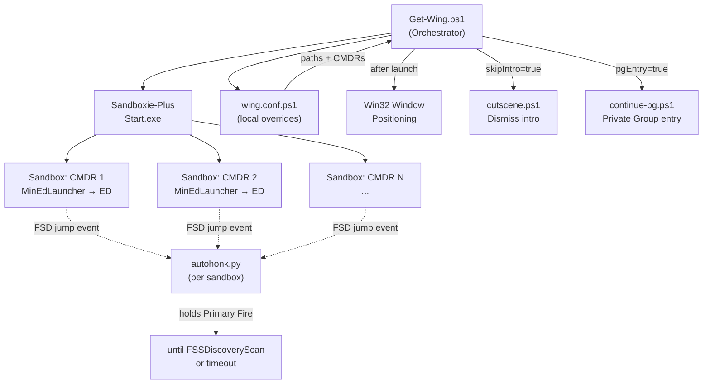

<div align="center">

# 🛸 EDWing

**Multi-commander Elite Dangerous automation — launch, position, and automate an entire wing from one script.**

[](https://github.com/Quadstronaut/EDWing/commits/master)
[](https://github.com/Quadstronaut/EDWing)
[](https://github.com/Quadstronaut/EDWing)
[](https://learn.microsoft.com/en-us/powershell/)
[](https://learn.microsoft.com/en-us/windows/win32/)
[](https://www.python.org/)
[](https://sandboxie-plus.com/)
[](https://github.com/rfvgyhn/min-ed-launcher)

---

[](#prerequisites)
[](#quick-start)
[](#components)
[](#configuration)
[](#autohonk)
[](#window-positioning)

</div>

---

> [!NOTE]
> **Personal use, public release.** Configurations are tuned to a specific multi-monitor setup and will require adjustment for different hardware layouts. Not affiliated with or endorsed by Frontier Developments plc.

## 🗺️ At a Glance

| Capability | How |
|---|---|
| Launch multiple ED clients | Sandboxie-Plus sandboxes, one per commander |
| Multi-profile startup | MinEdLauncher — one `[Profile.AccountN]` per CMDR |
| Window layout | Win32 API — absolute pixel positioning across monitors |
| Skip intro cutscenes | `clicker_scripts/cutscene.ps1` |
| Auto-enter Private Group | `clicker_scripts/continue-pg.ps1` |
| Auto-honk on FSD jump | `autohonk/autohonk.py` (Python 3, journal watcher) |
| Credential persistence | `.cred` file backup/restore across sandbox wipes |
| Companion apps | EDMC, EDEB, EDCoPilot (optional, disabled by default) |

---

## 🏗️ Architecture



---

<a id="prerequisites"></a>
## ✅ Prerequisites

| Requirement | Notes |
|---|---|
| Windows (Win32 API) | Required for window positioning |
| [Sandboxie-Plus](https://sandboxie-plus.com/) | One sandbox box per commander, named to match your CMDR names |
| [MinEdLauncher](https://github.com/rfvgyhn/min-ed-launcher) | Third-party launcher that enables multi-profile Elite startup |
| Elite Dangerous via Steam | Only Steam installation is supported |
| PowerShell 5.1 or later | Ships with Windows 10/11 |
| Python 3.x + `pip install -r requirements.txt` | For AutoHonk only |

<details>
<summary>Optional companion apps (disabled by default)</summary>

| App | Purpose | Installer Script |
|---|---|---|
| [ED Market Connector](https://github.com/EDCD/EDMarketConnector) | Market / route data | `installer_scripts/edcd_edmarketconnector.ps1` |
| [Elite Dangerous Exploration Buddy (EDEB)](https://www.panostrede.de/EDEB/) | Exploration helper | `installer_scripts/edeb.ps1` |
| [ED CoPilot](https://github.com/Razzafrag/EDCoPilot-Installer) | Voice assistant | `installer_scripts/razzafrag_edcopilot-installer.ps1` |

</details>

---

<a id="quick-start"></a>
## 🚀 Quick Start

```powershell
# 1. Clone
git clone https://github.com/Quadstronaut/EDWing.git

# 2. Copy and edit the local config override
Copy-Item example_configs\wing.conf.ps1.example wing.conf.ps1
# Edit wing.conf.ps1: set $cmdrNames, $sandboxieStart, $minEDLauncher, and any path overrides

# 3. Launch
.\Get-Wing.ps1
```

> [!IMPORTANT]
> `wing.conf.ps1` is gitignored — it holds your local paths and commander names. See [Configuration](#configuration) below.

---

<a id="components"></a>
## 📦 Components

| File / Folder | What it does |
|---|---|
| `Get-Wing.ps1` | Main orchestrator — launches, positions windows, runs post-launch scripts |
| `wing.conf.ps1` *(gitignored)* | Your local overrides for paths and feature toggles |
| `example_configs/wing.conf.ps1.example` | Starter template for the above |
| `autohonk/autohonk.py` | Watches Elite journal files; holds Primary Fire key after FSD jumps until `FSSDiscoveryScan` fires |
| `clicker_scripts/cutscene.ps1` | Double-clicks each client window to dismiss the intro cutscene |
| `clicker_scripts/continue-pg.ps1` | Clicks through Continue → Private Group → Launch on each client |
| `clicker_scripts/MouseUtil.ps1` | Shared mouse helper (dot-sourced by the two scripts above) |
| `input_broadcast.ps1` / `input_broadcast.py` | Experimental — relay keypresses to all Elite windows. **Not functional as of current master.** |
| `installer_scripts/` | One-shot download-and-install scripts for MinEdLauncher, EDMC, EDEB, EDCoPilot |
| `example_configs/` | Annotated config templates for MinEdLauncher |

---

<a id="configuration"></a>
## ⚙️ Configuration

Copy `example_configs/wing.conf.ps1.example` to `wing.conf.ps1` in the repo root and edit it. Any variable set there overrides `Get-Wing.ps1` defaults.

**Minimum required changes:**

```powershell
# Your sandbox names — must match Sandboxie box names AND MinEdLauncher profile names
$cmdrNames = @("CMDRFirst", "CMDRSecond", "CMDRThird", "CMDRFourth")

# Paths on your machine
$sandboxieStart = 'C:\Path\To\Sandboxie\Start.exe'
$minEDLauncher  = 'C:\Path\To\Elite Dangerous\MinEdLauncher.exe'
```

**Feature toggles:**

| Key | Default | Purpose |
|---|---|---|
| `launchEliteDangerous` | `$true` | Launch Elite clients |
| `launchEDMC` | `$false` | Also launch EDMC per sandbox |
| `launchEDEB` | `$false` | Launch EDEB for the first commander |
| `skipIntro` | `$true` | Run `cutscene.ps1` after launch |
| `pgEntry` | `$true` | Run `continue-pg.ps1` after cutscene skip |
| `SeedCredentials` | `$true` | Back up and restore MinEdLauncher `.cred` files across sandbox wipes |
| `StopCustomServicesAndProcesses` | `$false` | Kill background apps before launch |

### MinEdLauncher Configuration

See `example_configs/min-ed-launcher_min-ed-launcher.ini` and `example_configs/min-ed-launcher_settings.json` for annotated templates. MinEdLauncher expects one `[Profile.AccountN]` section per commander (email/password on first run, auto-login `.cred` file thereafter).

> [!WARNING]
> Use `sandboxie-start` (the Sandboxie-Plus launcher binary) instead of the legacy `start` command referenced in older MinEdLauncher documentation.

---

<a id="autohonk"></a>
## 🔊 AutoHonk

Monitors Elite journal files and automatically holds the Primary Fire key after an FSD jump, releasing when `FSSDiscoveryScan` completes (or after a configurable timeout). The Primary Fire key is read from your Elite key bindings file automatically; override with `--key` if needed.

Run one instance per sandbox:

```bash
# For sandboxed commanders
python autohonk/autohonk.py --sandbox CMDRYourBoxName

# For the primary (unsandboxed) commander
python autohonk/autohonk.py
```

**CLI flags:**

| Flag | Default | Description |
|---|---|---|
| `--sandbox` / `-s` | none | Sandboxie box name; resolves virtualised journal path |
| `--window-filter` / `-w` | sandbox name | Substring to match in Elite window title |
| `--delay` | `2.0` | Seconds after jump before firing |
| `--max-duration` | `7.0` | Maximum seconds to hold the key |
| `--key` | auto-detect | Override the key (e.g. `1`, `space`, `numpad_add`) |
| `--verbose` / `-v` | off | Debug logging |

---

<a id="window-positioning"></a>
## 🖥️ Window Positioning

Alt-monitor Elite clients are positioned at absolute pixel coordinates (negative X = left of primary monitor). The defaults in `Get-Wing.ps1` assume a specific multi-monitor layout.

> [!CAUTION]
> Adjust `$eliteWindows` X/Y/Width/Height values in `wing.conf.ps1` for your setup. Clicker script coordinates (`cutscene.ps1`, `continue-pg.ps1`) are similarly pixel-absolute and **must be re-tuned** if your resolution or monitor arrangement differs.

---

<a id="installer-scripts"></a>
## 🔧 Installer Scripts

`installer_scripts/` contains standalone PowerShell scripts to download and install each companion app. Edit the `$elitePath` / `$pathExtract` / `$DestinationPath` variables at the top of each script before running. These are one-shot helpers — they are **not** called by `Get-Wing.ps1`.

> [!WARNING]
> `edeb.ps1` and `razzafrag_edcopilot-installer.ps1` install to hardcoded paths by default; edit before use. `razzafrag_edcopilot-installer.ps1` has a known limitation: silent MSI install does not work correctly.

---

<a id="input-broadcast"></a>
## 🧪 Input Broadcast *(Experimental — Non-Functional)*

`input_broadcast.ps1` and `input_broadcast.py` attempt to relay keystrokes to all running Elite windows without requiring focus.

> [!CAUTION]
> Both are present for reference but are **not working** on current master. See the scripts for inline notes on the approaches tried.

---

## 🔗 See Also

- [GitHub Wiki](https://github.com/Quadstronaut/EDWing/wiki) — full reference
- [MinEdLauncher](https://github.com/rfvgyhn/min-ed-launcher)
- [Sandboxie-Plus](https://sandboxie-plus.com/)
